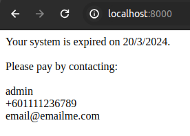

# Show End-System notification

Set an expiration date for the system.

## Step 1
```
composer require Zahiruddinnorzain\Endsystem
```

## Step 2

Run this command

```
php artisan make:middleware CheckSystem
```

put this in middleware

```
use DateTime;
use Zahiruddinnorzain\Endsystem\EndSystemServiceProvider;
```
```
$hari = 20;
$bulan = 3;
$tahun = 2024;
$name = "admin";
$contact = "+601111236789";
$email = "email@emailme.com";
$status_pay = false;

$today = new DateTime(); 
$givenDate = new DateTime("$tahun-$bulan-$hari");
// Compare the dates
if ( ($today > $givenDate) && ($status_pay == false) ) {
    $endsistem = new EndSystemServiceProvider;
    return $endsistem->show($hari,$bulan,$tahun,$contact,$email,$name);
}else{
    return $next($request);
}
```
## Step 3
put this in web.php route file

```
use App\Http\Middleware\CheckSystem;

Route::middleware([CheckSystem::class])->group(function () {

    Route::get('/', function () {
        return view('welcome');
    });

});

```
## Preview


